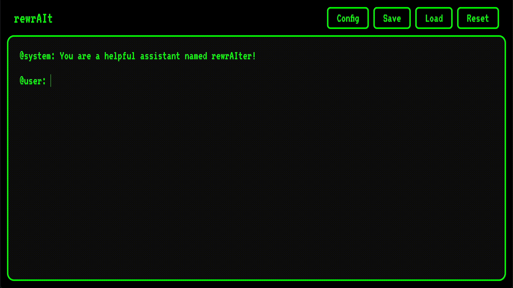

# rewrAIt - Control The Narrative With Your LLM.


Are you prompting the model or is the model prompting *you*? 

## Overview

rewrAIt offers a unique 'text-editor' style interface for turn-based conversations with large language models that lets you revise **any** part of an LLM conversation- system, user, or AI messages, at any point in time. Add context, modify responses, remove information or change providers to your liking.

## Usage Guide



The entire interface is an active text editor with three main labels: `@system:`, `@user:` and `@ai`. Messages are sent to the llm provider when the `enter` key is pressed as the caret is in an active `@user: ` section. AI responses are streamed back with an `@ai: ` label. For newlines in `@user: ` sections use `shift + enter`.

At any point you can edit any text seen on screen, regardless of whether it's been written by the user or generated by the LLM. Send `@user: clear` to clear the conversation without resetting the system prompt, and use the reset button to fully clear.

The `save` and `load` buttons both export the conversation into a `.txt` file, or load `.txt` files back into the interface.

The config button allows you to specify your provider and model of choice. Current providers supported are: `openai`, `anthropic`, and `gemini`. Ensure you have your specific provider key in the environment or `.env` file of your project.

## Quick Start

1. Clone the repo

```bash
$ git clone https://github.com/ALucek/rewrAIt.git
$ cd rewrAIt
```

2. Create a `.env` file for provider API keys

```yaml
OPENAI_API_KEY=""
ANTHROPIC_API_KEY=""
GEMINI_API_KEY=""
```

3. Deploy with Docker

```bash
$ docker compose up --build
```

Once the server is running, open your browser to the printed URL and start your conversation.

## Contributing

Contributions welcome, please feel free to submit a Pull Request.

Todo:
1. Local model support
2. Additional providers (HF, DeepSeek, etc)

## License

MIT License - See [LICENSE](LICENSE)

[](https://opensource.org/licenses/MIT)
